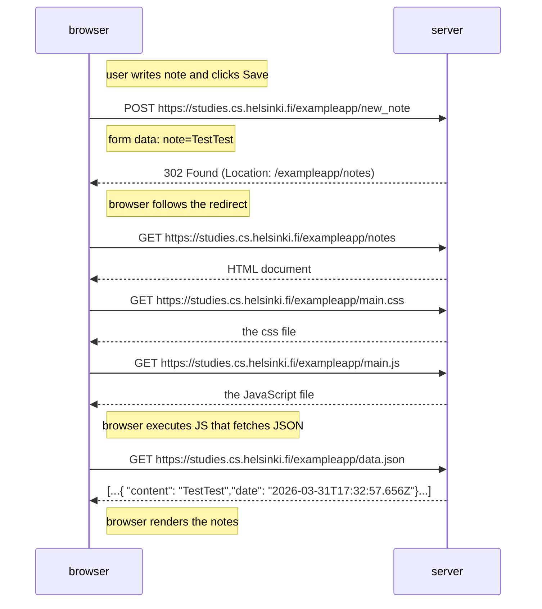

```mermaid
sequenceDiagram
    participant browser
    participant server

    Note right of browser: user writes note and clicks Save
    browser->>server: POST https://studies.cs.helsinki.fi/exampleapp/new_note
    Note right of browser: form data: note=TestTest
    server-->>browser: 302 Found (Location: /exampleapp/notes)

    Note right of browser: browser follows the redirect
    browser->>server: GET https://studies.cs.helsinki.fi/exampleapp/notes
    server-->>browser: HTML document

    browser->>server: GET https://studies.cs.helsinki.fi/exampleapp/main.css
    server-->>browser: the css file
    browser->>server: GET https://studies.cs.helsinki.fi/exampleapp/main.js
    server-->>browser: the JavaScript file

    Note right of browser: browser executes JS that fetches JSON
    browser->>server: GET https://studies.cs.helsinki.fi/exampleapp/data.json
    server-->>browser: [...{ "content": "TestTest","date": "2026-03-31T17:32:57.656Z"}...]
    Note right of browser: browser renders the notes
```
