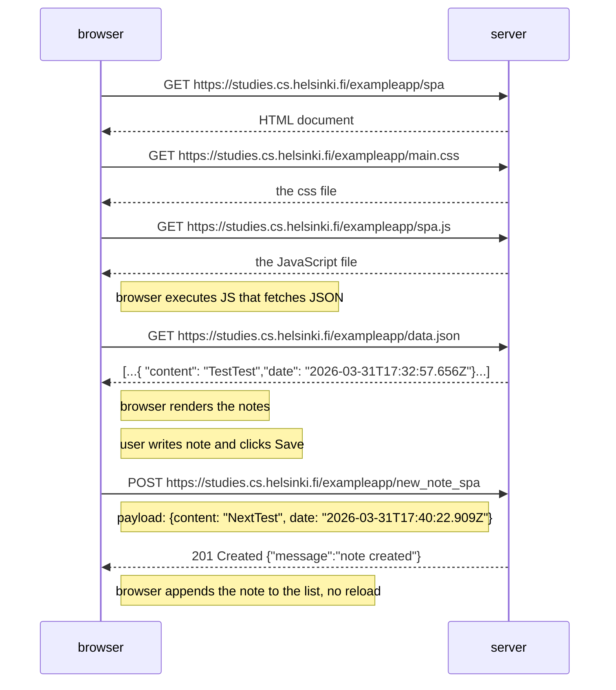

```mermaid
sequenceDiagram
    participant browser
    participant server

    browser->>server: GET https://studies.cs.helsinki.fi/exampleapp/spa
    server-->>browser: HTML document
    browser->>server: GET https://studies.cs.helsinki.fi/exampleapp/main.css
    server-->>browser: the css file
    browser->>server: GET https://studies.cs.helsinki.fi/exampleapp/spa.js
    server-->>browser: the JavaScript file
    Note right of browser: browser executes JS that fetches JSON
    browser->>server: GET https://studies.cs.helsinki.fi/exampleapp/data.json
    server-->>browser: [...{ "content": "TestTest","date": "2026-03-31T17:32:57.656Z"}...]
    Note right of browser: browser renders the notes
    Note right of browser: user writes note and clicks Save
    browser->>server: POST https://studies.cs.helsinki.fi/exampleapp/new_note_spa
    Note right of browser: payload: {content: "NextTest", date: "2026-03-31T17:40:22.909Z"}

    server-->>browser: 201 Created {"message":"note created"}
    Note right of browser: browser appends the note to the list, no reload
```
